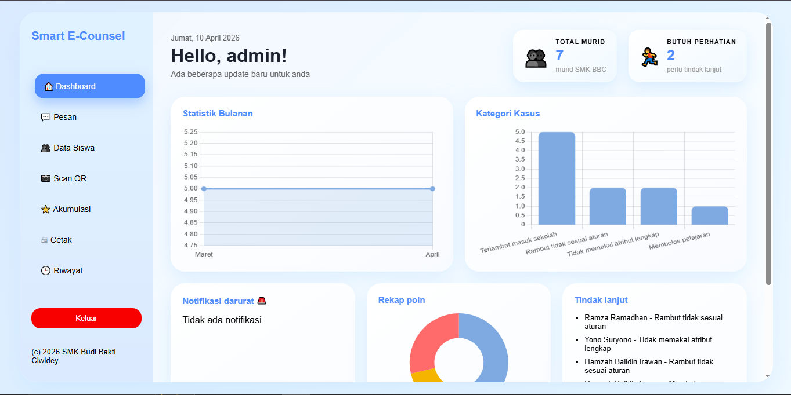
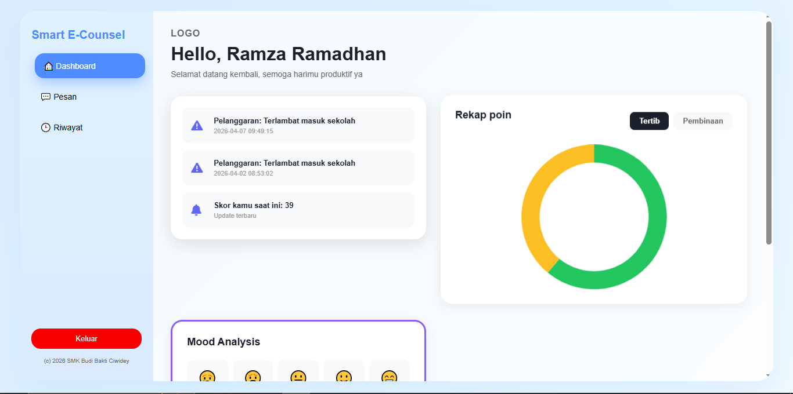
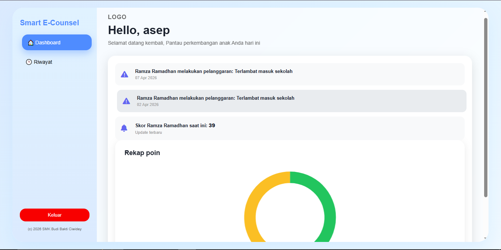
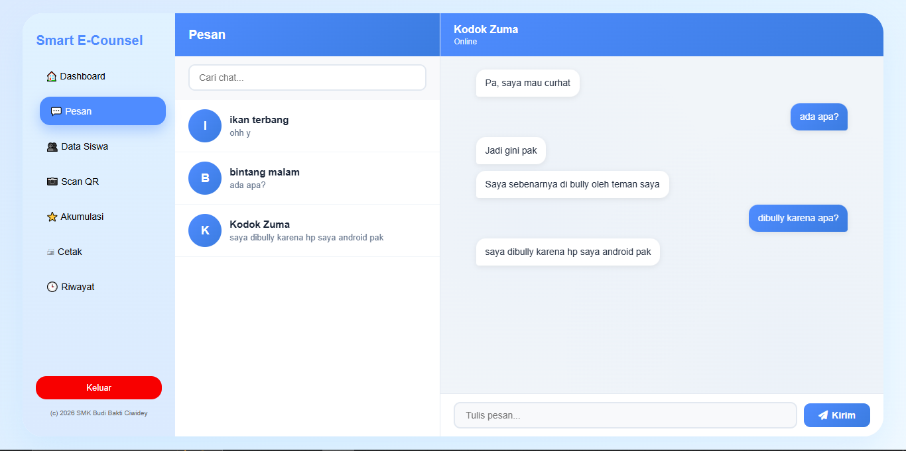
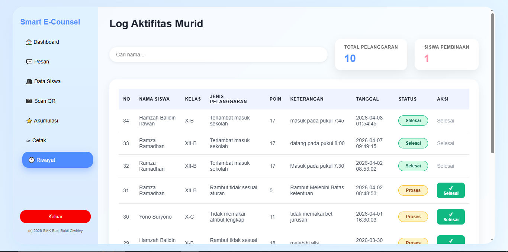

# 🎓 SmartCounsel-BK

Sistem Informasi Bimbingan Konseling berbasis web untuk membantu sekolah dalam mengelola data siswa, pelanggaran, serta komunikasi antara guru BK, siswa, dan orang tua.

---

## 📌 Deskripsi Aplikasi

SmartCounsel-BK adalah aplikasi berbasis web yang dibangun menggunakan framework Laravel. Sistem ini dirancang untuk mendigitalisasi proses bimbingan konseling di sekolah agar lebih efektif, terstruktur, dan mudah diakses oleh berbagai pihak (Admin, Guru BK, Siswa, dan Orang Tua).

---

## 🎯 Tujuan Pengembangan

- Mempermudah pengelolaan data siswa
- Mencatat dan memonitor pelanggaran siswa
- Menyediakan komunikasi (chat) antara siswa dan guru BK
- Menyajikan data dalam bentuk dashboard interaktif

---

## 🚀 Fitur Utama

### 👨‍🏫 Admin / Guru BK

- Manajemen data siswa
- Input pelanggaran dan poin
- Monitoring riwayat pelanggaran
- Dashboard statistik (chart)
- Fitur chat dengan siswa

### 🎓 Siswa

- Melihat riwayat pelanggaran
- Melihat total poin
- Chat dengan guru BK
- Dashboard personal

### 👨‍👩‍👧 Orang Tua

- Monitoring aktivitas siswa
- Melihat riwayat pelanggaran anak
- Dashboard ringkasan

---

## 🛠️ Teknologi & Library

### Backend

- PHP (Native)
- Laravel Framework

### Frontend

- Blade Template Engine
- JavaScript
- AJAX

### Library Tambahan

- Chart.js (visualisasi data)
- Laravel Eloquent ORM
- Laravel Authentication

### Database

- MySQL

### Tools

- XAMPP (Apache & MySQL)
- Composer
- Node.js & NPM
- Git & GitHub

---

## 📸 Screenshot Aplikasi

### 🔐 Halaman Login


### 📊 Dashboard Admin



### 📊 Dashboard Siswa



### 📊 Dashboard Orang Tua



### 📈 Grafik Statistik


### 💬 Fitur Chat



### 📋 Riwayat Pelanggaran



---

## ⚙️ Cara Instalasi di Komputer Lain

### 1. Persiapan Software

Pastikan sudah menginstall:

- XAMPP
- Composer
- Node.js
- Git

---

### 2. Clone Project

```bash
git clone https://github.com/ramza-cpu/CodeCrafter_E-Counseling_BK.git
cd smartcounsel-bk
```

---

### 3. Install Dependency

```bash
composer install
npm install
```

---

### 4. Konfigurasi Environment

```bash
cp .env.example .env
```

Edit file `.env`:

```env
DB_DATABASE=smartcounsel
DB_USERNAME=root
DB_PASSWORD=
```

---

### 5. Import Database

#### 📌 Langkah Import smartcounsel.sql

1. Buka **phpMyAdmin**
2. Buat database baru:

    ```
    smartcounsel
    ```

3. Klik database tersebut
4. Pilih menu **Import**
5. Upload file:

    ```
    smartcounsel.sql
    ```

6. Klik **Go / Import**

---

### 6. Generate Key

```bash
php artisan key:generate
```

---

### 7. Jalankan Server

```bash
php artisan serve
```

Akses aplikasi:

```
http://127.0.0.1:8000
```

---

## 🔐 Akun Login (Jika Ada)

| Role      | Username  | Password |
| --------- | --------- | -------- |
| Admin     | [admin]   | password |
| Guru      | [guru]    | password |
| Orang Tua | [asep]    | password |
| Siswa     | [ramizud] | 123456   |

---

## 📂 Struktur Folder Penting

```
app/                → Logic aplikasi
routes/             → Routing
resources/views/    → Tampilan (Blade)
public/             → Asset (CSS, JS, Images)
database/           → Migration & Seeder
```

---

## 🧪 Troubleshooting

### ❌ Error Class / Autoload

```bash
composer dump-autoload
```

---

### ❌ Error Cache Laravel

```bash
php artisan config:clear
php artisan cache:clear
php artisan view:clear
```

---

### ❌ Error Database

- Pastikan MySQL berjalan di XAMPP
- Cek konfigurasi `.env`
- Pastikan database sudah diimport

### ❌ Port 8000 Sudah Digunakan

Gunakan port lain:

```bash
php artisan serve --port=8001
```

---

## 📈 Pengembangan Selanjutnya

- Notifikasi real-time
- Export laporan (PDF / Excel)
- Role & permission lebih detail
- Pesan dapat diterima tanpa perlu refresh halaman

---

## 👨‍💻 Developer

Tim Pengembang:

- Nurul Azni
- Rian Firmansah
- M. Ramza Ramadhan

---

## 📄 Lisensi

Digunakan untuk keperluan pembelajaran dan pengembangan.

---

## ⭐ Penutup

SmartCounsel-BK diharapkan dapat membantu meningkatkan efektivitas layanan bimbingan konseling di sekolah melalui sistem digital yang modern dan terintegrasi.
